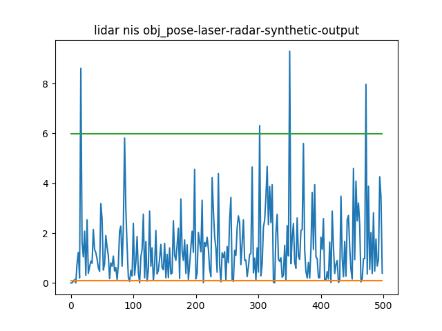
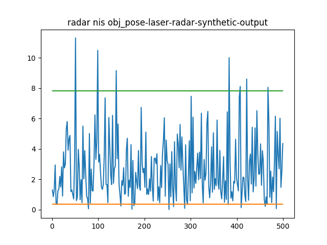
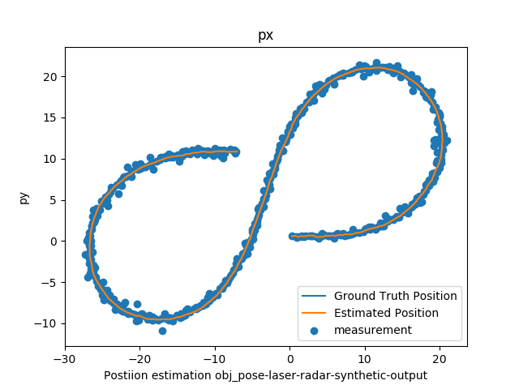
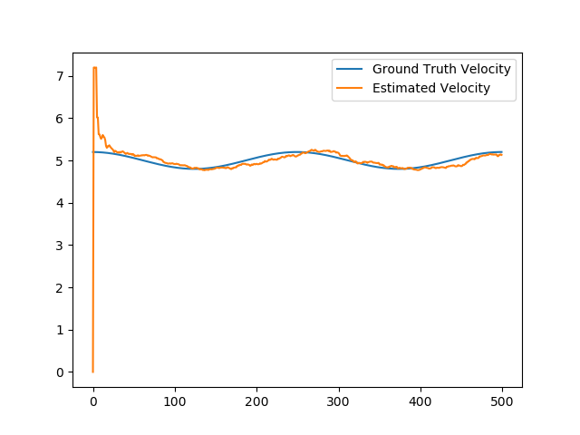
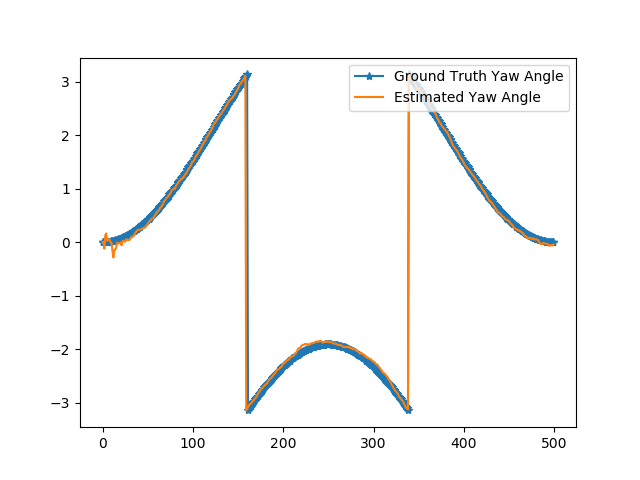

# Unscented Kalman Filter Project
Self-Driving Car Engineer Nanodegree Program

---
## RMSE

Here is the RMSE for the data set "obj_pose-laser-radar-synthetic-input.txt" of the UKF implementation:

(Rubric's requirement: [.09, .10, .40, .30])

    Accuracy - RMSE:
    0.286903
    0.288844
     1.97078
      1.6197

## NIS

Here are the NIS curves. The choice of motion noise (std_a, std_yawdd) is based on heuristics, basing on the distribution of the 
measurements of rho (longitude speed), analysis of the ground truth result in the distribution statistics of turning 
angle rate acceleration, and the assumption of the characteristics of bike' movement. My analysis suggested much larger 
std_a, and std_yawdd for dataset 1, but too large values would cause estimations eventually becomes all "nan" values. 

## Estimation Visualization

## Estimation Accuracy of Different Sensors

Experiments were conducted with LIDAR alone, and RADAR alone. The overall estimation performance were compared. The following are the order of the performance, from the best to the worst: 

1. LIDAR and RADAR combined
2. LIDAR alone
3. RADAR alone

With LIDAR alone, the estimations of positions, velocity, and turning angle (yaw) were fairly accurate. 

With RADAR alone, the estimation is much coarse. 

## Further Studies

More study is needed to understand the characteristics of numerical calculation to address the tendency of divergence to "nan" values. 

Furthermore, when there is more time, I'd like to implement more validation and test support for assurance of implementation correctness. 
It's quite error prone in the implementation, causing doubt of the nature of the problems whether it's of the appropriateness of algorithm, 
or the correctness of implementation. 

## Dependencies

* cmake >= v3.5
* make >= v4.1
* gcc/g++ >= v5.4

## Basic Build Instructions

1. Clone this repo.
2. Make a build directory: `mkdir build && cd build`
3. Compile: `cmake .. && make`
4. Run it: `./UnscentedKF path/to/input.txt path/to/output.txt`. You can find
   some sample inputs in 'data/'.
    - eg. `./UnscentedKF ../data/obj_pose-laser-radar-synthetic-input.txt`

## Project Instructions and Rubric

This information is only accessible by people who are already enrolled in Term 2
of CarND. If you are enrolled, see [the project page](https://classroom.udacity.com/nanodegrees/nd013/parts/40f38239-66b6-46ec-ae68-03afd8a601c8/modules/0949fca6-b379-42af-a919-ee50aa304e6a/lessons/c3eb3583-17b2-4d83-abf7-d852ae1b9fff/concepts/f437b8b0-f2d8-43b0-9662-72ac4e4029c1)
for instructions and the project rubric.
