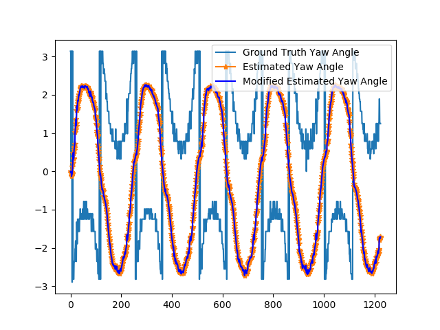

# Unscented Kalman Filter Project
Self-Driving Car Engineer Nanodegree Program

---
## RMSE

Here is the RMSE of the UKF implementation:

For both of the datasets, the RMSE meet the rubric. 

### For sample dataset 1:

- 0.0499589
- 0.055368
- 0.582238
- 0.530754

### For sample dataset 2:

- 0.154096
- 0.183253
- 0.249703
- 0.353453

## NIS

Here are the NIS curves. The choice of motion noise (std_a, std_yawdd) is based on heuristics, basing on the distribution of the 
measurements of rho (longitude speed), analysis of the ground truth result in the distribution statistics of turning 
angle rate acceleration, and the assumption of the characteristics of bike' movement. My analysis suggested much larger 
std_a, and std_yawdd for dataset 1, but too large values would cause estimations eventually becomes all "nan" values. 

Also, these two datasets have rather different motion noise patterns. Dataset 2 would need much smaller std_a and std_yawdd. 

## Estimation Visualization

### Dataset 1

In the following, the velocity estimation is mostly negative. The negation of which seems much closer to the ground truth, and the measurements. 

I tried to transform the negative velocity estimation into positive one by negating the velocity value and adjusting the yaw angle to be one PI shift 
(that is, also change the direction of the movement direction of the speed to compensate on the negation of the velocity.) However, when applying the transformation
in the program, it caused the estimations eventually becomes "nan" values. The root cause is not yet understood. 

In the following diagram, I tried to show the effect of transformation, in lieu of the failed implementation in the UnscentedKF program. 
The negated velocity (Modified Estimated Velocity) is shown as blue color line.
The adjusted yaw (Modified Estimated Yaw Angle) is shown in blue color. However, it turned out to be the same as the original estimated yaw angle. 

### Dataset 2

For dataset 2, there is not much issue. 

## Further Studies

More study is needed to understand the characteristics of numerical calculation to address the tendency of divergence to "nan" values. 

Furthermore, when there is more time, I'd like to implement more validation and test support for assurance of implementation correctness. 
It's quite error prone in the implementation, causing doubt of the nature of the problems whether it's of the appropriateness of algorithm, 
or the correctness of implementation. 

## Dependencies

* cmake >= v3.5
* make >= v4.1
* gcc/g++ >= v5.4

## Basic Build Instructions

1. Clone this repo.
2. Make a build directory: `mkdir build && cd build`
3. Compile: `cmake .. && make`
4. Run it: `./UnscentedKF path/to/input.txt path/to/output.txt`. You can find
   some sample inputs in 'data/'.
    - eg. `./UnscentedKF ../data/sample-laser-radar-measurement-data-1.txt output.txt`

## Project Instructions and Rubric

This information is only accessible by people who are already enrolled in Term 2
of CarND. If you are enrolled, see [the project page](https://classroom.udacity.com/nanodegrees/nd013/parts/40f38239-66b6-46ec-ae68-03afd8a601c8/modules/0949fca6-b379-42af-a919-ee50aa304e6a/lessons/c3eb3583-17b2-4d83-abf7-d852ae1b9fff/concepts/4d0420af-0527-4c9f-a5cd-56ee0fe4f09e)
for instructions and the project rubric.
