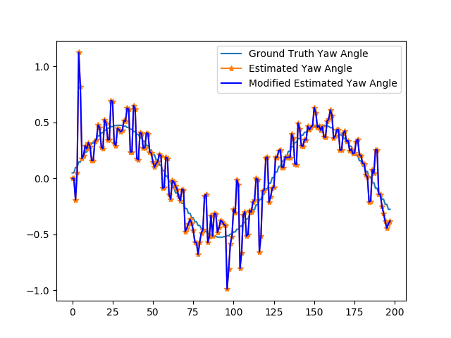

# Unscented Kalman Filter Project
Self-Driving Car Engineer Nanodegree Program

---
## RMSE

Here is the RMSE of the UKF implementation:

For sample 1:
0.0495916
0.0564871
 0.517909
 0.528349

For sample 2:
0.168976
0.182777
0.277011
0.352458

## NIS

Here are the NIS curves

## Estimation Visualization

## Dependencies

* cmake >= v3.5
* make >= v4.1
* gcc/g++ >= v5.4

## Basic Build Instructions

1. Clone this repo.
2. Make a build directory: `mkdir build && cd build`
3. Compile: `cmake .. && make`
4. Run it: `./UnscentedKF path/to/input.txt path/to/output.txt`. You can find
   some sample inputs in 'data/'.
    - eg. `./UnscentedKF ../data/sample-laser-radar-measurement-data-1.txt output.txt`

## Project Instructions and Rubric

This information is only accessible by people who are already enrolled in Term 2
of CarND. If you are enrolled, see [the project page](https://classroom.udacity.com/nanodegrees/nd013/parts/40f38239-66b6-46ec-ae68-03afd8a601c8/modules/0949fca6-b379-42af-a919-ee50aa304e6a/lessons/c3eb3583-17b2-4d83-abf7-d852ae1b9fff/concepts/4d0420af-0527-4c9f-a5cd-56ee0fe4f09e)
for instructions and the project rubric.
